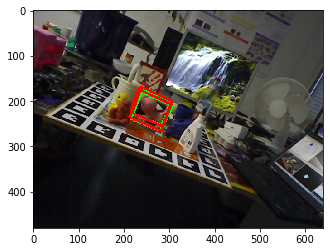

## [Dense Pose Object Detector](https://arxiv.org/abs/1902.11020)

This repo is a recreation of the methodology for 6D pose estimation by  DPOD: 6D Pose Object Detector and Refiner ,written by Sergey Zakharov, Ivan Shugurov, Slobodan Ilic.
Given a RGB image, the goal is to estimate the 6D pose of an object.
Model was trained and tested entirely on the Linemod dataset. For every 99 out of 100 images, MSCoco dataset was used to change the background of the input image for the correspondence block to prevent overfitting.

<p >
  
  
  
  Green box represents the ground truth pose and red box represents predicted pose
</p>


## Installation and Training steps

```
$ chmod +x dataset_install
$ ./dataset_install
$ git clone https://github.com/yshah43/DPOD.git
$ pip install -r requirements.txt
$ python train.py
$ python eval.py

```

## Overview of the code

Below is a brief description of the code:
1. create_ground_truth.py - create the grund truth ID, U and V masks and the changed background image.
2. correspondence_block.py - trainining loop for the correspondence block base on the Unet encoder decoder architecture
3. pose_block.py - use PnP and RANSAC for initial pose estimation
4. create_renderings.py - create input for DL based pose refiner
5. pose_refinement.py - training loop for DL based pose refiner
6. train.py - trainining script for all of the above
7. eval.py - evaluation script for all of the above

## References

[1]Sergey Zakharov, Ivan Shugurov, and Slobodan Ilic. Dpod: 6d pose object detector and refiner. In Proceedings of the IEEE International Conference on Computer Vision, pages 1941–1950, 2019.

[2] Hinterstoisser et al. "Model based training, detection and pose estimation of texture-less 3d objects in heavily cluttered scenes" ACCV 2012.

[3] Tsung-Yi Lin, Michael Maire, Serge Belongie, James Hays, Pietro Perona, Deva Ramanan, Piotr Dolla ́r, and C Lawrence Zitnick. Microsoft coco: Common objects in context. In European conference on computer vision, pages 740–755. Springer, 2014.
